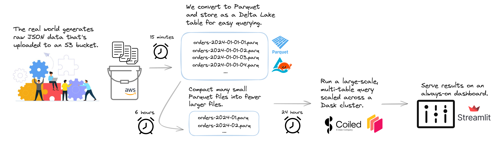

Example Production ETL System - TPC-H
=====================================

This repository contains a scalable example production data pipeline running on the cloud that represents what we commonly see in the wild.

While specific details vary across use cases, there are common pipeline steps and pain points. 

There are many considerations involved in constructing a data processing pipeline. We hope this example pipeline helps provide a path for addressing common pain points and serves as a template for your own use case.

The pipeline here is intended to show that running regular jobs on a schedule, at scale, on the cloud can be a delightful experience for Python developers. 


## Common data pipeline steps

While specific details vary across use cases, we often see these four steps:

- Step 1: **Real world generates raw data**
    - A customer makes a purchase
    - A satellite takes a measurement
    - ...
- Step 2: **Process that raw data**
    - A feature engineering step
    - Make data quality cuts
    - Convert to a different storage format
    - ...
- Step 3: **Address business needs using your data**
    - Large scale query of your data -- "How many purchases were returned at our store in NYC?"
    - Train an ML model for weather forecasting
    - ...
- Step 4: **Publish results**
    - Serve an interactive dashboard with a real-time view of customer orders
    - Host an ML model
    - ...


## Common data pipeline pain points

While the outline above is straightforward, in practice there are _many_ things one may need to consider when constructing a data pipeline.

Depending on your situation you may need to think about one or more of the following:

- Managing cloud infrastructure:
    - Provisioning / deprovisioning cloud machines
    - Software environment management
    - Cloud data access
    - Easy access to logs
    - Cost monitoring and spending limits
    - ...
- Pipeline orchestration:
    - Run steps at different regular cadences (e.g. process raw data every 5 minutes and retrain ML model once a day)
    - Task retry logic
    - Alerts if a certain task fails
    - ...
- Computational needs:
    - Easily run existing Python code on cloud machines
    - Compute at scale on larger-than-memory datasets
- ...


## Example pipeline

The data pipeline here represents just one specific workflow instance, but follows an overall common structure. We use the [TPC-H dataset](https://www.tpc.org/tpch/) 

- Step 1: **Data generation** &mdash; New JSON files with customer orders and supplier information appear (every 15 minutes)
- Step 2: **Data processing**
    - JSON gets transformed into Parquet / Delta (every 15 minutes)
    - Data compaction of small Parquet files into larger ones for efficient downstream usage (every 6 hours)
- Step 3: **Business queries** &mdash; Large scale multi-table analysis queries run that feed dashboards (every 24 hours)
- Step 4: **Serve dashboard** &mdash; Results from latest business queries are served on a dashboard

This is an example system that runs regular jobs on a schedule, at scale, on
the cloud using a variety of technologies:

-  **Prefect:** for job scheduling and workflow management
-  **Coiled:** for cloud hardware provisioning
-  **Dask:** for parallel processing
-  **Parquet** and **Deltalake:** for data storage
-  **Streamlit:** for dashboarding

It looks kinda like this:



How this works
--------------

### Prefect for workflow orchestration

The file [workflow.py](workflow.py) defines several Prefect flows operating at
different cadences:

```python
# workflow.py
...

generate = generate_json.to_deployment(
    name="generate_data",
    interval=timedelta(seconds=30),
)
preprocess = json_to_parquet.to_deployment(
    name="preprocess",
    interval=timedelta(minutes=1),
)

prefect.serve(
    generate,
    preprocess,
    ...
)
```

### Coiled Functions + Prefect Tasks

These flows are defined in files like [pipeline/preprocess.py](pipeline/preprocess.py), which combine prefect tasks either with Coiled functions for remote execution like the following:

```python
# pipeline/preprocess.py

import coiled
from prefect import task, flow
import pandas as pd

@task
@coiled.function(region="us-east-2", memory="64 GiB")
def json_to_parquet(filename):
    df = pd.read_json(filename)
    df.to_parquet(OUTFILE / filename.split(".")[-2] + ".parquet")

@flow
def convert_all_files():
    files = list_files()
    json_to_parquet.map(files)
```

### Dask Clusters for larger jobs

Or in files like [pipeline/reduce.py](pipeline/reduce.py) which create larger
clusters on-demand.

```python
# pipeline/reduce.py

import coiled
from prefect import task, flow
import dask.dataframe as dd

@task
def query_for_bad_accounts(bucket):
    with coiled.Cluster(n_workers=20, region="us-east-2") as cluster:
        with cluster.get_client() as client:
            df = dd.read_parquet(bucket)

            ... # complex query

            result.to_parquet(...)
```

How to Run Locally
------------------

Make sure you have a [Prefect cloud](https://www.prefect.io/cloud) account and have authenticated your local machine.

Create a software environment:

```bash
mamba env create -f environment.yml
```

Then run each command below in separate terminal windows:

```bash
python serve_model.py       # Serve ML model
```
```bash
python workflow.py          # Run ETL pipeline
```
```bash
streamlit run dashboard.py  # Serve dashboard
```

Watch things run, both in your terminals and on Prefect cloud, and then ctrl-C to shut everything down.

How to Run in the Cloud
-----------------------

This all works, we just haven't documented it well yet.
    
